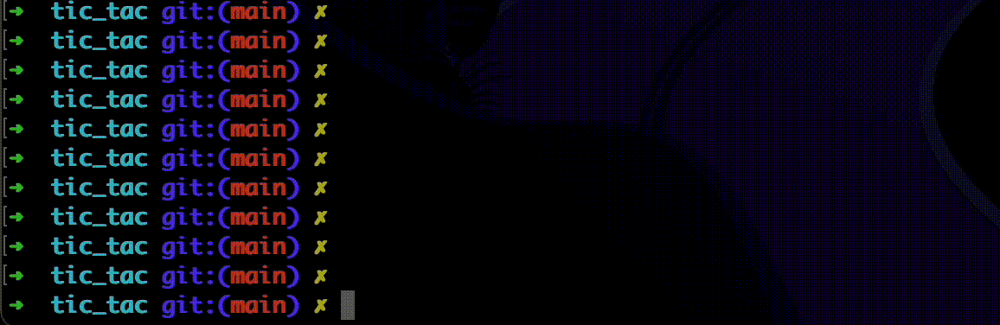
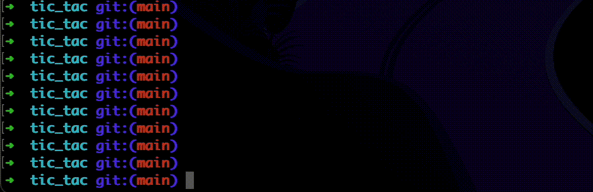

# TIC TAC

It’s a game where you win if you occupy `win_length` cells in a vertical, horizontal, or diagonal direction.

[](https://github.com/keeper121/tic_tac/actions/workflows/ci-cd.yml)

Install prerequisites:
```commandline
python3 -m pip install -r requirements.txt
```

How to play the game (2 players):

```commandline
python3 -m tic_tac
```



How to play the game with a computer:

```commandline
python3 -m tic_tac --computer
```




You can run the code from docker
```commandline
docker build . -t tic_tac_image
docker run -it tic_tac_image python3 -m tic_tac --computer
```

All possible parameters:
```
python3 -m tic_tac --help
usage: __main__.py [-h] [--size SIZE] [--players PLAYERS] [--computer] [--computer_type COMPUTER_TYPE] [--win_length WIN_LENGTH]

options:
  -h, --help            show this help message and exit
  --size SIZE           Game size in format "width,height" (default=7,5)
  --players PLAYERS     How many players will play? (default=2)
  --computer            Will the game be with a computer?
  --computer_type COMPUTER_TYPE
                        The computer difficulty if `--computer` is selected (default=COMPUTER_HARD)
  --win_length WIN_LENGTH
                        How many cells to win? (default=3)
```


### Developers sections

How to run tests (required docker installed)

```
bash ./tests/pytest.sh -xvvs ./tests/unit
```


Possible improvements:
- Add validators for all parameters;
- Add a window-based GUI;
- Add more tests;
- More advanced computer;
- Save/restore the game status;
- Use Poetry/UV package manager;
- Use mypy in the code health stage;